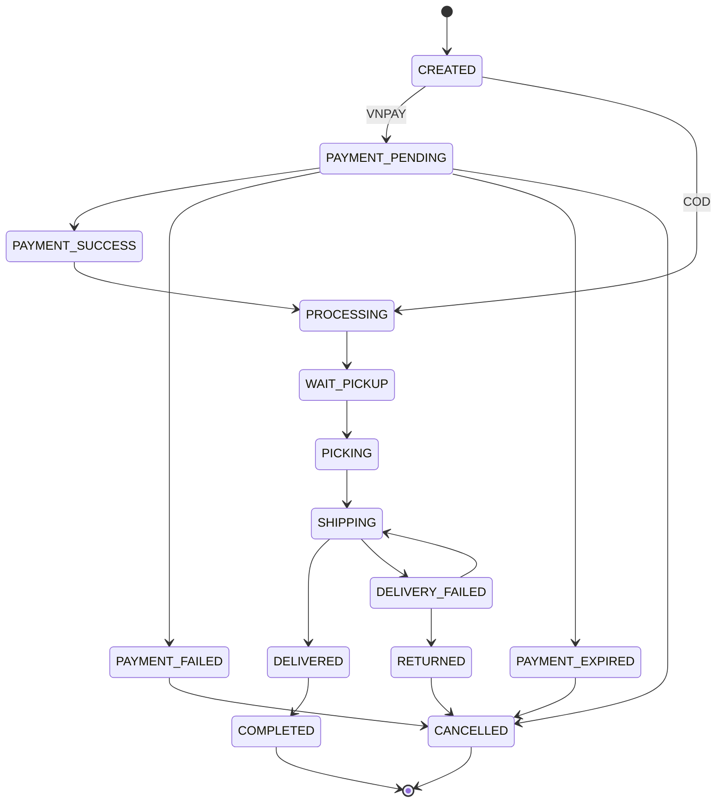
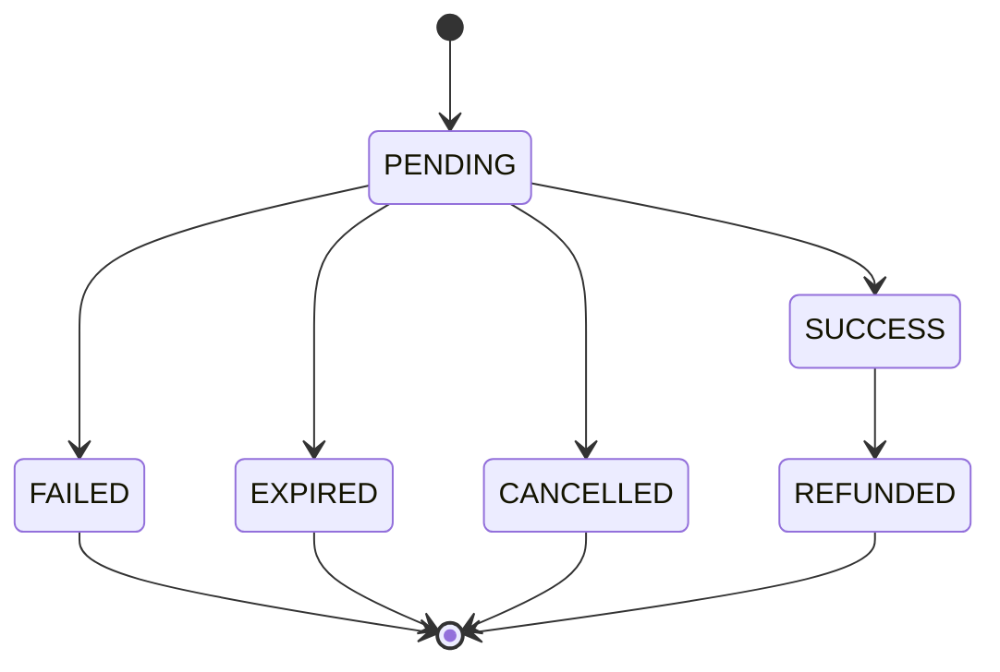
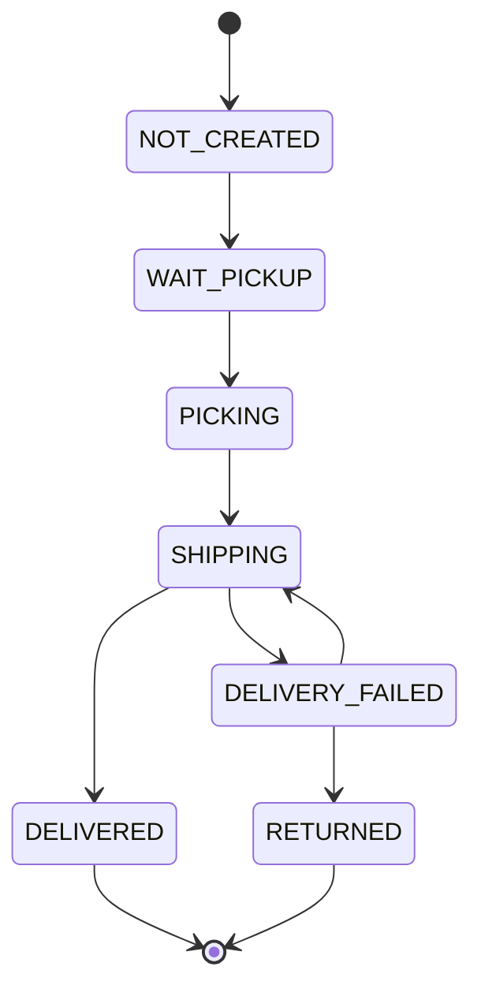
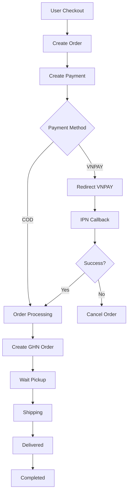
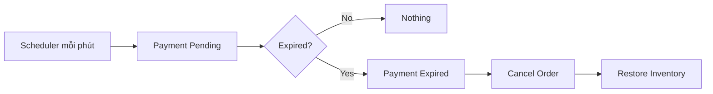
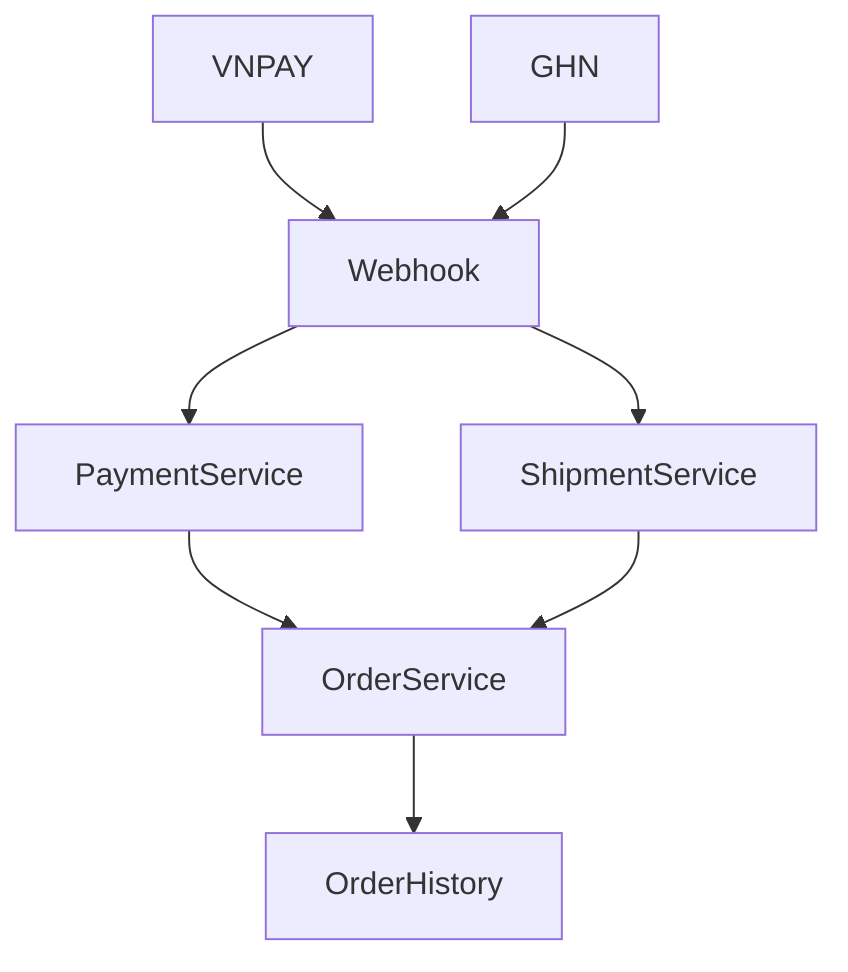
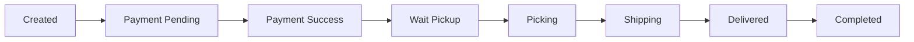
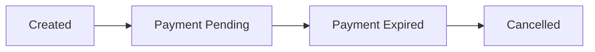
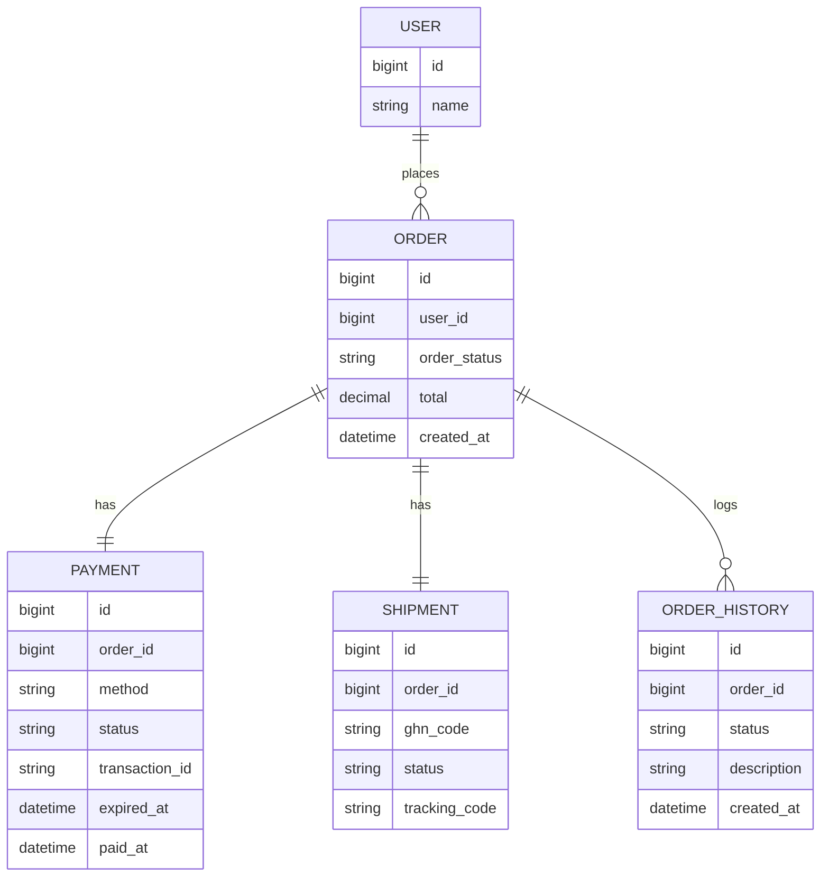
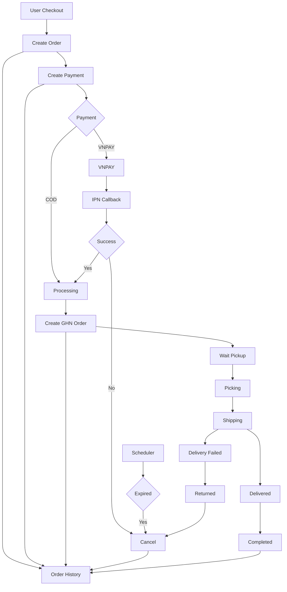

# 1. Luồng tổng quát của một đơn hàng



---

# 2. Tách riêng Payment

Đây là phần quan trọng với VNPAY.



Ví dụ:

```
10:00

Create Payment

↓

PENDING

↓

Redirect VNPAY

↓

IPN Callback

↓

SUCCESS
```

Hoặc

```
10:15

Scheduler

↓

EXPIRED
```

---

# 3. Shipment

GHN có nhiều trạng thái nhưng ta map về trạng thái nội bộ.



---

# 4. Các service tương tác



---

# 5. Scheduler

Cái này thường bị bỏ sót.



---

# 6. Webhook

Cả GHN và VNPAY đều nên đi qua webhook.



---

# 7. Order History



Nếu timeout:



---

# 8. ERD đơn giản



---

# 9. Sơ đồ mình khuyên dùng cho dự án của bạn

Đây là sơ đồ tổng hợp toàn bộ nghiệp vụ:



## Tuy nhiên, sau khi làm khá nhiều hệ thống dạng này, mình còn bổ sung một nguyên tắc thiết kế quan trọng:

**`Order` không nên "điều khiển" Payment và Shipment.**

Thay vào đó:

* `Payment` phát sinh sự kiện **PaymentSucceeded**.
* `OrderService` nhận sự kiện đó và quyết định tạo đơn GHN.
* `GHN Webhook` phát sinh **ShipmentDelivered**.
* `OrderService` nhận sự kiện và cập nhật Order thành Completed.
* Mọi thay đổi đều ghi vào `OrderHistory`.

Đây là kiến trúc gần với cách các hệ thống e-commerce thực tế vận hành và sẽ giúp bạn dễ mở rộng thêm MoMo, ZaloPay, GHTK, Viettel Post hoặc xử lý hoàn tiền mà không phải sửa quá nhiều logic cũ.
