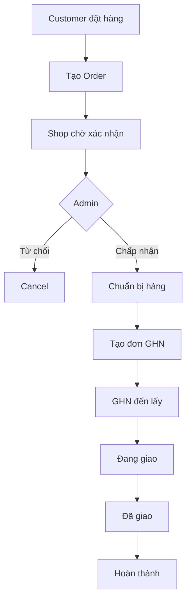
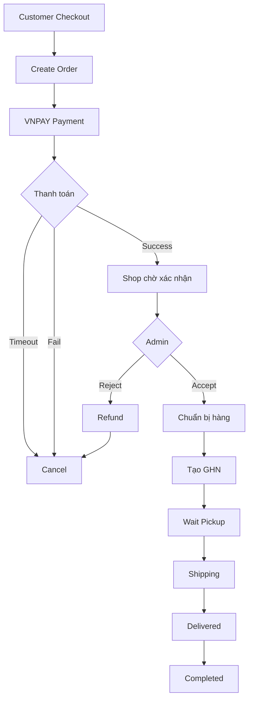
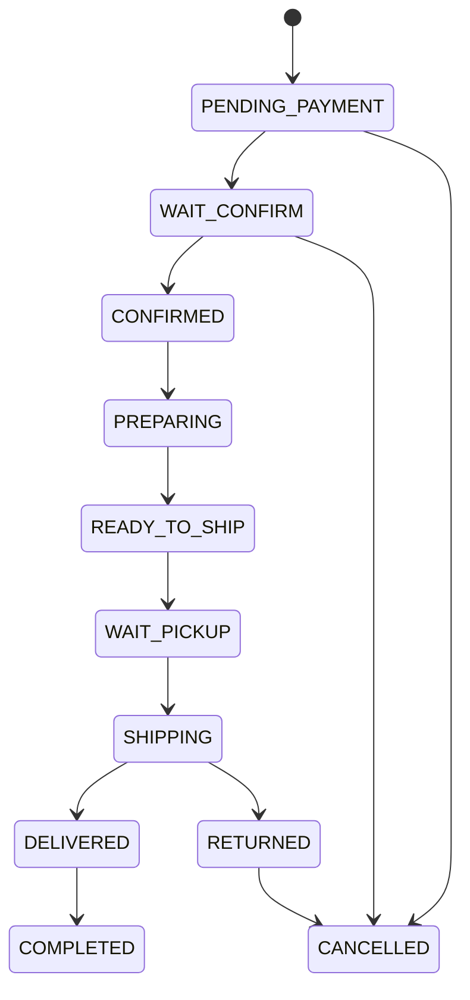
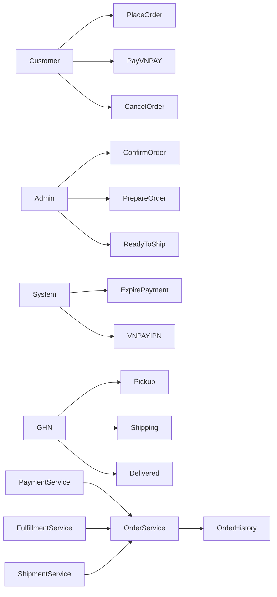

## Business flow.

# Actor

```text
Customer

↓

Shop/Admin

↓

Payment

↓

Warehouse

↓

GHN

↓

Customer
```

---

# Luồng COD



---

# Luồng VNPAY



---

# Thực tế Shop có những quyền gì?

## Pending

```
Có đơn mới
```

Admin thấy:

```
Đơn #1001

Khách:

Nguyễn Văn A

Thanh toán:

Đã thanh toán

Trạng thái:

Chờ xác nhận

[Nhận đơn]

[Từ chối]
```

---

## Accept

Admin bấm:

```
Nhận đơn
```

Order:

```
WAIT_CONFIRM

↓

CONFIRMED
```

Ghi history:

```
10:00

Shop đã xác nhận đơn
```

---

## Prepare

```
CONFIRMED

↓

PREPARING
```

Admin:

```
Đang đóng gói
```

---

## Ready

Khi đóng gói xong:

```
PREPARING

↓

READY_TO_SHIP
```

Lúc này mới:

```
Create GHN Order
```

---

## GHN

GHN:

```
WAIT_PICKUP

↓

PICKING

↓

SHIPPING

↓

DELIVERED
```

---

# Thực ra Order Status nên như này



---

# Nhưng còn một vấn đề lớn hơn...

Thực tế nên tách thành 4 state machine độc lập.

## Order

```
CREATED

CONFIRMED

COMPLETED

CANCELLED
```

## Payment

```
PENDING

SUCCESS

FAILED

EXPIRED

REFUNDED
```

## Fulfillment (Shop)

Đây là cái mình quên đề cập.

```
PENDING

CONFIRMED

PREPARING

READY_TO_SHIP
```

## Shipping

```
NOT_CREATED

WAIT_PICKUP

PICKING

SHIPPING

DELIVERED

RETURNED
```

Ví dụ:

| Order   | Payment | Fulfillment | Shipping    |
| ------- | ------- | ----------- | ----------- |
| CREATED | SUCCESS | PREPARING   | NOT_CREATED |

Admin chỉ thao tác với Fulfillment.

---

# Một điểm rất hay mà các sàn TMĐT đều làm

**Admin không được sửa trực tiếp status.**

Ví dụ:

```
[Nhận đơn]

↓

ConfirmOrderCommand

↓

FulfillmentService

↓

Update State

↓

Create History

↓

Notify Customer
```

Admin không có dropdown:

```
Status:

[Shipping]

Save
```

vì rất dễ làm hỏng nghiệp vụ.

---

# Theo mình, với dự án JSP/Servlet của bạn, actor nên được phân quyền như sau:



Đây là mô hình mình sẽ chọn cho một website bán hàng thực tế:

* **Customer**: đặt hàng, thanh toán, hủy đơn khi chưa xử lý.
* **Admin/Shop**: nhận đơn, chuẩn bị hàng, xác nhận sẵn sàng giao.
* **System**: xử lý timeout VNPAY, webhook thanh toán, gửi thông báo.
* **GHN**: nhận hàng, vận chuyển, giao thành công/thất bại.

Quan trọng nhất là tư duy: **Shop không điều khiển Payment hay GHN trực tiếp**. Shop chỉ quản lý quá trình **fulfillment (xử lý đơn hàng)**, còn Payment và Shipping là các subsystem độc lập. Đây là cách thiết kế khá gần với các nền tảng như Shopify, WooCommerce hay các hệ thống e-commerce quy mô lớn.
