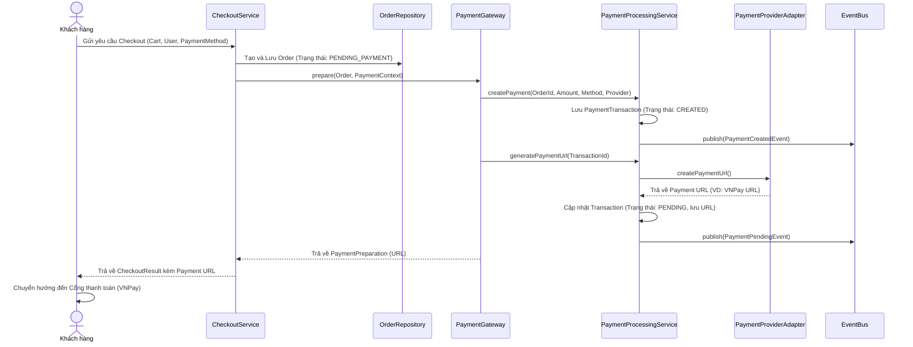
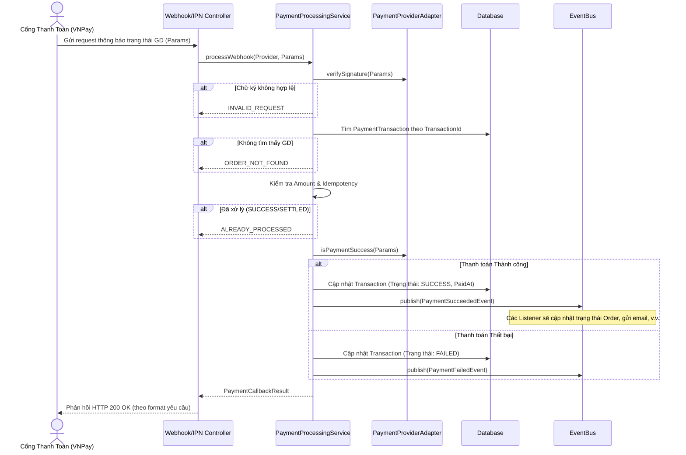
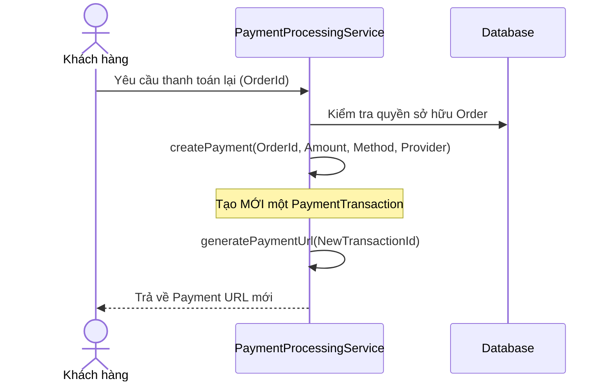

# Tài liệu Module Thanh Toán (Payment Module)

Tài liệu này cung cấp cái nhìn tổng quan và chi tiết về các luồng nghiệp vụ (business flows) của Module Thanh Toán trong hệ thống Souvenir E-commerce.

## 1. Tổng quan Kiến trúc

Module thanh toán được thiết kế theo hướng sự kiện (Event-driven) và áp dụng mẫu thiết kế Adapter/Factory để dễ dàng tích hợp với nhiều cổng thanh toán khác nhau (ví dụ: VNPay) mà không ảnh hưởng đến logic nghiệp vụ cốt lõi.

**Các thành phần chính:**
- `PaymentProcessingService`: Dịch vụ trung tâm xử lý logic tạo giao dịch, tạo URL thanh toán và xử lý webhook.
- `PaymentAdapterFactory` & `PaymentProviderAdapter`: Cung cấp giao diện chuẩn hóa để giao tiếp với các nhà cung cấp dịch vụ thanh toán cụ thể (VNPay, Momo, v.v.).
- `PaymentGatewayRegistry`: Đăng ký và quản lý các cổng thanh toán khả dụng.
- **EventBus**: Sử dụng để phát các sự kiện (`PaymentCreatedEvent`, `PaymentPendingEvent`, `PaymentSucceededEvent`, `PaymentFailedEvent`) giúp tách biệt (decouple) logic thanh toán khỏi các module khác (như gửi email, thông báo).

## 2. Các Luồng Nghiệp Vụ Chính (Business Flows)

### 2.1. Luồng Khởi tạo Thanh toán (Checkout & Payment Initialization)

Khi khách hàng thực hiện đặt hàng (Checkout), hệ thống sẽ khởi tạo đơn hàng và tạo giao dịch thanh toán tương ứng nếu phương thức không phải là COD.

**Mô tả chi tiết:**
1. Khách hàng gọi API checkout. Hệ thống kiểm tra giỏ hàng, tồn kho và địa chỉ giao hàng.
2. `CheckoutService` lưu đơn hàng với trạng thái ban đầu (`PENDING_PAYMENT` đối với thanh toán online).
3. `PaymentGateway` tương ứng được gọi để chuẩn bị thanh toán.
4. `PaymentProcessingService` tạo một bản ghi `PaymentTransaction` mới trong database để theo dõi giao dịch.
5. URL thanh toán (Payment URL) được tạo ra thông qua `PaymentProviderAdapter` (ví dụ: tạo chữ ký và URL chuyển hướng đến VNPay).
6. Khách hàng nhận được URL và được chuyển hướng đến trang thanh toán của đối tác.

---

### 2.2. Luồng Xử lý Webhook (IPN - Instant Payment Notification)

Đây là luồng quan trọng nhất để xác nhận khách hàng đã thanh toán thành công hay chưa, dựa trên phản hồi bất đồng bộ từ đối tác thanh toán (VNPay IPN).

**Mô tả chi tiết:**
1. Khi khách hàng thanh toán xong, Cổng thanh toán gọi webhook (IPN) về hệ thống.
2. `PaymentProcessingService` bắt buộc phải **xác minh chữ ký (Signature)** để đảm bảo request thực sự đến từ đối tác.
3. Kiểm tra tính hợp lệ của giao dịch: ID có tồn tại không, số tiền (Amount) trả về có khớp với đơn hàng không.
4. **Idempotency**: Nếu giao dịch đã ở trạng thái `SUCCESS` hoặc `SETTLED`, hệ thống bỏ qua để tránh xử lý trùng lặp.
5. Nếu giao dịch thành công:
    - Cập nhật trạng thái `PaymentTransaction` thành `SUCCESS`.
    - Phát ra sự kiện `PaymentSucceededEvent`. Các thành phần khác (như `OrderService`) sẽ lắng nghe sự kiện này để cập nhật trạng thái đơn hàng thành `Chờ xác nhận` hoặc `Đã thanh toán`.
6. Trả về kết quả cho cổng thanh toán để xác nhận đã ghi nhận.

---

### 2.3. Luồng Thanh Toán Lại (Retry Payment)

Xảy ra khi khách hàng đã đặt hàng, tạo URL thanh toán nhưng chưa thanh toán, hoặc thanh toán trước đó bị lỗi/hết hạn.

**Mô tả chi tiết:**
- Thay vì sử dụng lại `PaymentTransaction` cũ (có thể đã hết hạn hoặc bị lỗi trên hệ thống đối tác), hệ thống tạo một `PaymentTransaction` **mới** liên kết với cùng một `Order`.
- Mã tham chiếu giao dịch gửi lên đối tác sẽ là mã mới, tránh lỗi trùng lặp mã giao dịch.

## 3. Quản lý Trạng thái (State Management)

### Payment Transaction Status
- `CREATED`: Vừa khởi tạo trong DB.
- `PENDING`: Đã tạo URL chuyển hướng, chờ khách thanh toán.
- `SUCCESS`: Khách đã thanh toán thành công (xác nhận từ Webhook/IPN).
- `FAILED`: Khách hủy thanh toán hoặc giao dịch bị lỗi.
- `SETTLED`: Đã đối soát tiền với đối tác.

> [!IMPORTANT]
> **Nguyên tắc thiết kế cốt lõi**: Trạng thái thanh toán (Payment Status) và Trạng thái đơn hàng (Order Status) được quản lý độc lập. Việc cập nhật Order Status dựa trên Payment Status được thực hiện thông qua **EventBus**, giúp mã nguồn lỏng lẻo (loosely coupled) và dễ bảo trì.
